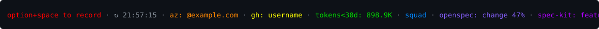

# GitHub Copilot CLI custom statusline

This repository shows how to use a custom GitHub Copilot CLI statusline on macOS.

> **Windows users:** see [`windows/`](windows/README.md) for a PowerShell port and the Windows-specific setup (notably the `feature_flags.enabled: ["STATUS_LINE"]` requirement and the `.cmd` wrapper).



## What it shows

The statusline displays useful context at the bottom of Copilot CLI:

```text
option+space to record · ↻ 21:57:15 · az: @example.com · gh: username · tokens<30d: 898.9K · squad · openspec: change 47% · spec-kit: feature 3/8 · colima: 1/2
```

Segments only appear when their related tool or project marker is available.

## Prerequisites

Install [GitHub Copilot CLI](https://docs.github.com/en/copilot/concepts/agents/about-copilot-cli):

```bash
brew install --cask copilot-cli
```

Install the tools and dependencies for the segments you want to see:

| Segment | Tool | Install |
| --- | --- | --- |
| Azure account | [Azure CLI](https://learn.microsoft.com/cli/azure/install-azure-cli) | `brew install azure-cli` |
| GitHub account | [GitHub CLI](https://cli.github.com/) | `brew install gh` |
| Token usage | [AI Engineering Fluency CLI](https://github.com/rajbos/ai-engineering-fluency/blob/main/docs/cli/README.md) | `npm install -g @rajbos/ai-engineering-fluency` |
| Spec Kit dependency | [uv](https://docs.astral.sh/uv/) | `brew install uv` |
| OpenSpec progress | [OpenSpec](https://github.com/Fission-AI/OpenSpec/) | `npm install -g @fission-ai/openspec@latest` |
| Spec Kit progress | [Spec Kit](https://github.com/github/spec-kit) | `uv tool install specify-cli --from git+https://github.com/github/spec-kit.git` |
| Squad context | [Squad CLI](https://www.npmjs.com/package/@bradygaster/squad-cli) | `npm install -g @bradygaster/squad-cli` |
| Voice recording hint | [Handy](https://github.com/cjpais/Handy) | `brew install --cask handy` |
| Colima containers | [Colima](https://github.com/abiosoft/colima) | `brew install colima` |

You also need `jq` because `statusline.sh` parses Copilot CLI status JSON:

```bash
brew install jq
```

Authenticate the CLIs you want to use:

```bash
az login
gh auth login
```

## Step 1: enable the statusline

In GitHub Copilot CLI, run:

```text
/statusline
```

Enable the custom statusline when prompted.

## Setup

Download the script file:

```bash
mkdir -p ~/.copilot
curl -fsSL https://raw.githubusercontent.com/pascalvanderheiden/copilot-cli-custom-statusline/main/statusline.sh -o ~/.copilot/statusline.sh
chmod +x ~/.copilot/statusline.sh
```

Edit `~/.copilot/settings.json` and add or merge:

```json
{
  "experimental": true,
  "statusLine": {
    "type": "command",
    "command": "~/.copilot/statusline.sh"
  }
}
```

Verify the script by running it directly:

```bash
~/.copilot/statusline.sh
```

## Segment explanation

| Segment | Color | Meaning |
| --- | --- | --- |
| `option+space to record` |  `#ff0000` | Handy voice-recording shortcut reminder. |
| `↻ HH:MM:SS` |  `dim` | Last statusline refresh time. |
| `az: ...` |  `#ff8700` | Signed-in Azure CLI account from `az account show`. |
| `gh: ...` |  `#ffff00` | Active GitHub CLI account from `gh auth status`. |
| `tokens<30d: ...` |  `#00d700` | Last 30 days token usage from `ai-engineering-fluency usage`. |
| `squad` |  `#0087ff` | Indicator that a Squad context is initialized when `.squad` exists in the project. |
| `openspec: ...` |  `#875fff` | OpenSpec changes and task completion when `openspec` or `.openspec` exists. |
| `spec-kit: ...` |  `#af00ff` | Spec Kit state or task completion when `.specify` or `specs/` exists. |
| `colima: R/T` |  `#ff00ff` | Number of running (`R`) Colima instances out of total (`T`) from `colima list`. |

## Troubleshooting

- If a segment is missing, install or authenticate the related CLI.
- If the statusline does not load, check `chmod +x ~/.copilot/statusline.sh`.
- If `~` is not expanded in `settings.json`, use the full path, for example `/Users/your-user/.copilot/statusline.sh`.
- If `settings.json` stops loading, validate that commas around the `statusLine` block are correct.
- Restart Copilot CLI after changing the script or settings.
